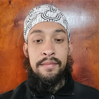
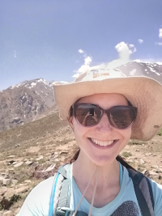

--------
I have listed former students, post-docs, and visiting students.

* **[Postdocs](#postdocs)** 
* **[Graduate students](#graduate-students)**
* **[Undergraduate students](#undergraduate-students)**
* **[Visiting undergraduate students](#visiting-undergraduate-students)**
* **[Visiting graduate students](#visiting-graduate-students)**

--------

## Postdocs

`2020--2022`
*Renato Cifuentes La Mura*, PhD in Biosciences Engineering from The Katholieke Universiteit Leuven (Belgium). Postdoctoral
research stay at the Biometrics Group at the [Center for Ecosystem Modelling and Monitoring of the Universidad Mayor](http://cem.umayor.cl), supported by The FONDEF program, Chile.

`2018-2021`
*[Andrés Fuentes-Ramirez](https://andresfuen.weebly.com)*, PhD in Ecology and Evolutionary Biology from Iowa State University (USA). Postdoctoral
research stay at Laboratorio de Biometría, Universidad de La Frontera, supported by The Attraction and Insertion of Advanced Human Capital Program (PAI) of CONICYT-Chile.

`2016-2018`
*[Rodrigo Vargas-Gaete](https://rodrigovargasgaete.cl)*, PhD in Natural Resources from the Albert-Ludwigs Freiburg University (Germany). Postdoctoral research stay at Laboratorio de Biometría, Universidad de La Frontera, supported by Vicerrectoría de Investigación y Postgrado, Universidad
de La Frontera. (Currently, Rodrigo is an Associate Professor at Universidad de La Frontera, Temuco, Chile).

`2015-2017`
*Andrés Fuentes-Ramirez*, Postdoctoral research stay at Laboratorio de Biometría, Universidad de La Frontera, supported by Vicerrectoría de Investigación y Postgrado, Universidad
de La Frontera.

`2013-2015`
*Rodrigo Vargas-Gaete*, Postdoctoral research stay at Laboratorio de Biometría, Universidad de La Frontera,
supported by the PAI program of CONICYT-Chile.

## Graduate students

|   |   |   |
|---|---|---|
|*Heraldo Carvacho*  |  Master in Natural Resources Management, Universidad de La Frontera. **2021**.   |     |
|---|---|---|

`2021`
*Heraldo Carvacho*, Master in Natural Resources Management, Universidad de La Frontera. Currently at Town council of Pudahuel (Santiago, Chile).

`2020`
*Juan Pino*, Master in Natural Resources Management, Universidad de La Frontera. Currently at Ministry of the Environment (Temuco, Chile).

`2019`
*Joaquín Riquelme*, Master in Natural Resources Management, Universidad de La Frontera. Currently a Research Assistant, Universidad Mayor (Santiago, Chile).

`2019`
*Víctor Rocco*, Master in Natural Resources Management, Universidad de La Frontera. Currently at Direccion de Investigación, Universidad Nacional Andres Bello (Santiago, Chile).

`2019`
*Christian Azocar*, Master in Natural Resources Management, Universidad de La Frontera. Currently, Forestry Consultant (Puerto Montt, Chile).

`2018`
*Eduardo Palma*, Master in Natural Resources Management, Universidad de La Frontera.

`2018`
*Camilo Matus*, Master in Natural Resources Management, Universidad de La Frontera.

`2017`
*Cristian Segovia*, Master in Natural Resources Management, Universidad de La Frontera. Currently at Forest Biometrics Unit, Forestal Arauco (Concepción, Chile).

`2017`
*Renato Cifuentes*, Ph.D. in Bioscience Engineering, Katholieke Universiteit Leuven Belgium.

`2014`
*Diego Ponce*, M.S. in Forest Sciences, Universidad Austral de Chile. Currently at National Forest Service of Chile in Valdivia. [Committee Professor]

`2013`
*Pieter Moysons*, M.S. in de bio-ingenieurswetenschappen: landen bosbeheer, Katholieke Universiteit Leuven Belgium.

`2013`
*Inal Painemal*, Master in Natural Resources Management, Universidad de La Frontera. Currently at National Forest Service of Chile in Vallenar.

`2013`
*[Daniel Soto](https://sites.google.com/view/silviculture/danielsotowebpage)*, M.S. in Forest Sciences, Universidad Austral de Chile. [Committee Professor]. Currently, Daniel is an Assistant Professor at Universidad de Aysén, Coyhaique, Chile. 

`2013`
*Valeska Yaitul*, Master in Natural Resources Management, Universidad de La Frontera. Currently at Direccion de Investigación, Universidad de La Frontera (Temuco, Chile).

## Undergraduate students

|   |   |   |
|---|---|---|
|*Camilo Flores*  |  B.S. in Forest Engineering, Universidad Mayor (Santiago, Chile). **2021**.   |     |
|*Denisse Van Sint*  |  B.S. in Biology, Universidad Católica de Chile (Santiago, Chile). **2020**.   |  |    
|*Thomas Koplow*  | B.S. in Biology, Universidad Católica de Chile (Santiago, Chile). **2020**.   |   |
|---|---|---|

`2020`
*Jose Miguel Bravo*, B.S. in Biology, Universidad Católica de Chile (Santiago, Chile).

`2018`
*Camila Molina*, B.S. in Natural Resources, Universidad Austral de Chile. [Committee Professor].

`2017`
*Joaquin Riquelme*, B.S. in Natural Resources Engineering, Universidad de La Frontera.

`2017`
*Rodrigo Ríos*, B.S. in Forest Engineering, Universidad Austral de Chile. [Committee Professor].

`2017`
*Roberto Vidal*, B.S. in Forest Engineering, Universidad Austral de Chile. [Committee Professor].

`2016`
*Camilo Matus*, B.S. in Natural Resources Engineering, Universidad de La Frontera.

`2016`
*Cristian Segovia*, B.S. in Natural Resources Engineering, Universidad de La Frontera. 

`2014`
*Grace Floody*, B.S. in Natural Resources Engineering, Universidad de La Frontera. Currently a Consultant in Lican Ray, Chile.

`2014`
*Humberto Inzunza*, B.S. in Natural Resources Engineering, Universidad de La Frontera. 

`2013`
*Miguel Carcamo*, B.S. in Natural Resources, Universidad Austral de Chile. [Committee Professor].

`2011`
*Victor Rocco*, B.S. in Forest Engineering, Universidad de La Frontera. 

`2007`
*Diego Echeverría*, B.S. in Forest Engineering, Universidad de La Frontera. 

`2006`
*Arnoldo Hormazabal*, B.S. in Forest Engineering, Universidad de La Frontera. 

`2006`
*Jose Pedrero*, B.S. in Forest Engineering, Universidad de La Frontera. Currently at Company Z-Baum in Lanco, Chile.

`2006`
*Patricio Apablaza*, B.S. in Forest Engineering, Universidad de La Frontera. 

`2006`
*Francisco Silva*, B.S. in Forest Engineering, Universidad de La Frontera. 

`2005`
*Andrés Marcoleta*, B.S. in Forest Engineering, Universidad de La Frontera. 

`2005`
*Jorge Marinao*, B.S. in Forest Engineering, Universidad de La Frontera. 

`2004`
*Iván Araos*, B.S. in Forest Engineering, Universidad de La Frontera. Currently, a Forest Engineer at Forestal Mininco, Los Angeles, Chile.

`2004`
*Gustavo Montes*, B.S. in Forest Engineering, Universidad de La Frontera. Currently, a Forestry Consultant in Curacautín, Chile.

`2004`
*Oscar Castillo*, B.S. in Forest Engineering, Universidad de La Frontera. 

`2004`
*Alex Jarpa*, B.S. in Forest Engineering, Universidad de La Frontera. Currently, a Forestry Consultant in Curacautín, Chile.

`2004`
*Patricio Pacheco*, B.S. in Forest Engineering, Universidad de La Frontera. Currently, an Assistant Professor at Universidad de La Frontera, Temuco, Chile.

`2003`
*Braulio Tapia*, B.S. in Forest Engineering, Universidad de La Frontera. 

`2003`
*Manuel Morales*, B.S. in Forest Engineering, Universidad de La Frontera. Currently at National Forest Service of Chile in San Jose de la Mariquina.

## Visiting undergraduate students

`2019`
*Nicolas Rodriguez*, B.S. in Geology, Universidad Mayor (Santiago, Chile).

`2017`
*Nicolas Pino*, B.S. in Mathematical Engineering, Universidad de La Frontera (Temuco, Chile).

## Visiting graduate students

`2019`
*Patricio Ojeda*, Doctoral program in Forest Sciences, Universidad Austral de Chile. 

`2012`
*Daniel Soto*, M.S. program in Forest Sciences, Universidad Austral de Chile. 

<!-- ### Footer
Last updated: August 2020 -->
