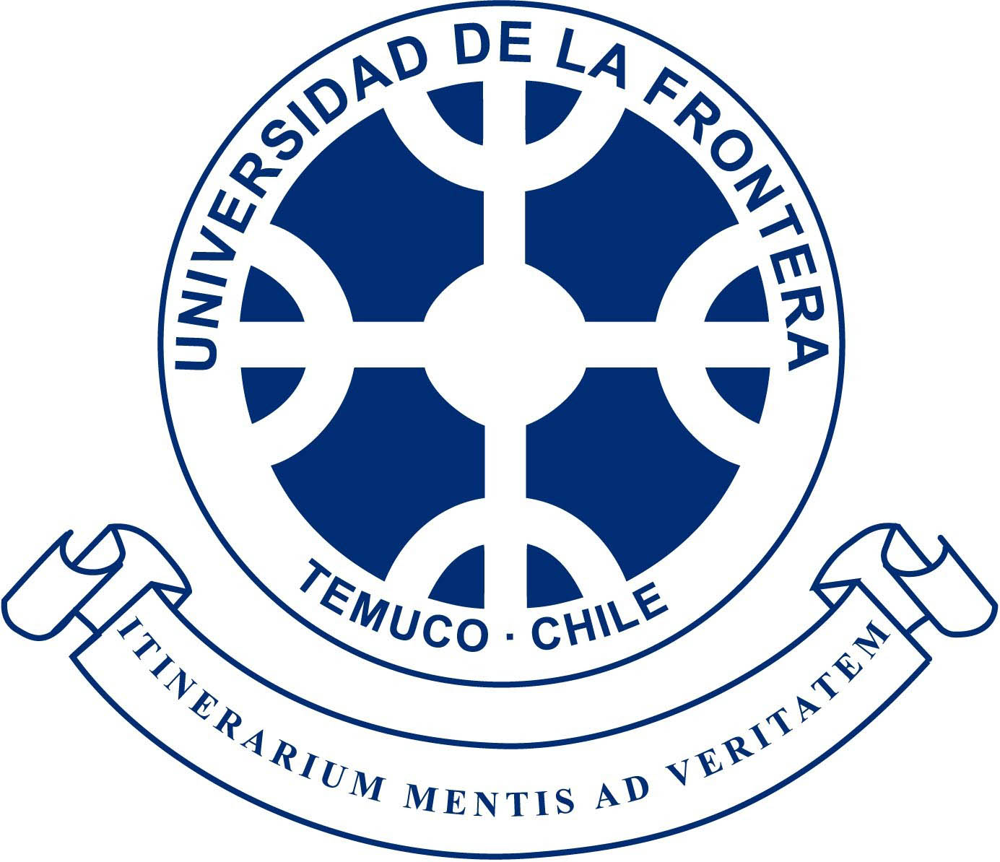

--------

`2011`
__[Yale University](https://www.yale.edu/)__, USA.  
Doctor of Philosophy in [Biometrics](https://environment.yale.edu/)

`2009`
__[Yale University](https://www.yale.edu/)__, USA.  
Master of Philosophy in [Biometrics](https://environment.yale.edu/)

`2006`
__[University of Idaho](https://www.uidaho.edu)__, USA.  
Master of Science in [Statistics](https://www.uidaho.edu/sci/stat)

`2000`
__[Universidad de La Frontera](https://www.ufro.cl)__, Chile.  
Bachelor of Science in Forest Enginneering

 
  

<!-- ### Footer

   

   

{:height="36px" width="36px"}
Last updated: August 2020 -->
