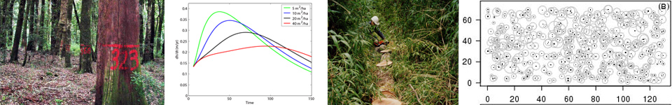

--------

* **[Peer-reviewed papers](#peer-reviewed-papers)** 
* **[Books](./rlibro.md)** 
* **[Chapters in books](./chapters.md)** 
* **[In proceedings](./proceed.md)** 

--------

## Peer-reviewed papers

If you do not have access to any of these papers, [drop me an e-mail](mailto:cseljatib@gmail.com).
For those papers written in Spanish, 
I have provided the title translation among [brackets] and using *italics, in green color*{: style="color: green; opacity: 0.80;" }.  

--------

`2022`
Cazzolla R,  Reich P, Gamarra J, Crowther T, Hui C,  ....Rutishauser E, Saikia P,  **Salas-Eljatib C**,  Schepaschenko D, Scherer-Lorenzen M, Šebeň V,  Silveira M, .... Liang J. 2022. [The number of tree species on Earth](https://doi.org/10.1073/pnas.2115329119). **Proceedings of the National Academy of Sciences of the United States of America (PNAS)** 119(6): e2115329119. 

`2022`
Donoso PJ, Promis A, Loguercio G, Beltran HA, Caselli M, Chauchard LM, Cruz G, Gonzales M, Martinez G, Navarro C, Nunez P, **Salas-Eljatib C**, Soto DP, Vasquez-Grandon A. 2022. [Silviculture of South American temperate native forests](https://doi.org/10.33494/nzjfs522022x173x). **New Zealand Journal of Forestry Science** 52: 2. 

`2021`
**Salas-Eljatib C**, Mehtatalo L, Gregoire TG, Soto DP, Vargas-Gaete R, 2021. [Growth equations in forest research: mathematical basis and model similarities](https://doi.org/10.1007/s40725-021-00145-8). **Current Forestry Reports** 7, 230-244. 

`2021`
**Salas-Eljatib C**. 2021. [A new algorithm for reconstructing tree height growth with stem analysis data](https://doi.org/10.1111/2041-210X.13616). **Methods in Ecology and Evolution** 12(10): 2008-2016.

`2021`
**Salas-Eljatib C**. 2021. [An approach to quantify climate-productivity relationships: an example from a widespread *Nothofagus* forest](https://doi.org/10.1002/eap.2285). **Ecological Applications** 31(4): e02285.

`2020`
**Salas-Eljatib C**. 2020. [Height growth–rate at a given height: a mathematical perspective for forest productivity](/myPubs/2020hgrate_ecoModelling.pdf). **Ecological Modelling** 431: 109198.

`2020`
**Salas-Eljatib C**, Weiskittel AR. 2020. [On studying the patterns of individual-based tree mortality in natural forests: a modelling analysis](https://doi.org/10.1016/j.foreco.2020.118369). **Forest Ecology and Management** 475: 118369.

`2020`
**Salas-Eljatib C**, Promis A. 2020. [Un llamado a la activación real de la Sociedad Chilena de Ciencias Forestales](/myPubs/2020socChCsForestales_bosque.pdf)
[*A call to awaken the Chilean Society of Forest Science*{: style="color: green; opacity: 0.80;"}].  **Bosque** 41(3): 209-212.

`2020`
Cardil A, de-Miguel S, Silva C, Reich P, Calkin D, Brancalion P, Vibrans A,.., Piotto D, **Salas-Eljatib C**, Broadbent E, et al. 2020. [Recent deforestation drove the spike in Amazonian fires](https://doi.org/10.1088/1748-9326/abcac7). **Environmental Research Letters** 15: 121003.

`2020`
Vargas-Gaete R, **Salas-Eljatib C**, Penneckamp D, Neira Z, Diez MC, Vargas-Picón R. 2020. [Estructura y regeneración de bosques de
Prumnopitys andina en los Andes del sur de Chile](http://dx.doi.org/10.4067/S0717-66432020000100048) \[*Structure and regeneration of Prumnopitys andina forests in the southern Andes of Chile*{: style="color: green; opacity: 0.80;"}\]. **Gayana Botanica** 77(1): 48–58.

`2020`
Soto DP, Donoso PJ, González-Chang M, Vásquez-Grandón A, **Salas-Eljatib C**. 2020. [Differential early performance of two underplanted hardwood
tree species following restoration treatments in high-graded temperate rainforests](https://doi.org/10.3390/f11040401). **Forests** 11(4): 401. 

`2020`
Donoso P, Puettmann K, D’Amato A, Ponce D, **Salas-Eljatib C**, Ojeda P. 2020. [Short-term effects of variable-density thinning on regeneration in hardwood-dominated temperate rainforests](https://doi.org/10.1016/j.foreco.2020.118058). **Forest Ecology and
Management** 464: 118058.

`2020`
Fuentes-Ramirez A, **Salas-Eljatib C**, González ME, Urrutia-Estrada J, Arroyo-Vargas P, Santibañez P. 2020. [Initial response of understory vegetation and tree regeneration to a mixed-severity fire in old-growth *Araucaria-Nothofagus* forests](https://doi.org/10.1111/avsc.12479). **Applied Vegetation Science** 23(2):
210–222.

`2020`
Bannister JR, Travieso G, Galindo N, Acevedo M, Puettmann K,**Salas-Eljatib C**. 2020. [Shrub influences on seedlings performance when restoring the slow-growing conifer Pilgerodendron uviferum in southern bog forests](https://doi.org/10.1111/rec.13090). **Restoration Ecology** 28(2): 396–407.

`2019`
Ponce DB, Donoso PJ, **Salas-Eljatib C**. 2019. [Índice de bosque adulto: Una herramienta para evaluar estados de desarrollo de bosques nativos de tierras bajas del centro-sur de Chile](https://scielo.conicyt.cl/pdf/bosque/v40n2/0717-9200-bosque-40-02-235.pdf) \[*Old-growth Index: a tool to evaluate developmental stages in native forests in the lowlands of south-central Chile*{: style="color: green; opacity: 0.80;"}\]. **Bosque** 40(2): 235–240.

`2019`
Steidinger BS, Crowther TW, Liang J, Van Nuland ME, Werner G, Reich P, Nabuurs G, de-Miguel S, Zhou M, Picard N, Herault B, Zhao X, Zhang C,
Routh D, Peay KG, Abegg M, ..., **Salas-Eljatib C**, et al. 2019. [Climatic controls of decomposition drive the global biogeography of
forest-tree symbioses](https://doi.org/10.1038/s41586-019-1128-0). **Nature** 569: 404–408.

`2019`
**Salas-Eljatib C**, Corvalán P, Pino N, Donoso PJ, Soto D. 2019. [Modelos de efectos mixtos de altura-diámetro para Drimys winteri en el
sur (41-43 S) de Chile](https://scielo.conicyt.cl/pdf/bosque/v40n1/0717-9200-bosque-40-01-00071.pdf) \[*Mixed-effects height-diameter
models for Drimys winteri in the south (41-43 S) of Chile*{: style="color: green; opacity: 0.80;"}\]. **Bosque** 40(1): 71–80.

`2019`
Vargas-Gaete R, Doussoulin, H, Smith-Ramírez C, Bravo S, **Salas-Eljatib C**, Andrade N, Trávníček B. 2019. [Evaluation of rust pathogenicity
(Phragmidium violaceum) as a biological control agent for the invasive plant Rubus ulmifolius on Robinson Crusoe Island, Chile](https://doi.org/10.1007/s13313-019-0615-y). **Australasian Plant Pathology** 48(3): 201–208.

`2019`
Donoso PJ, Schlegel B, **Salas-Eljatib C**, Donoso C. 2019. [Development of 26-year-old mixed forests following different regeneration cutting
treatments in Andean temperate rainforests of south-central Chile](https://doi.org/10.1016/j.foreco.2018.10.004). **Forest Ecology and Management** 432: 686–693.

`2018`
**Salas-Eljatib C**, Weiskittel AR. 2018. [Evaluation of modelling strategies for assessing self-thinning behavior and carrying capacity](https://doi.org/10.1002/ece3.4525). **Ecology and Evolution** 8(22): 10768–10779.

`2018`
**Salas-Eljatib C**, Fuentes-Ramirez A, Gregoire TG, Altamirano A, Yaitul V. 2018. [A study on the effects of unbalanced data when fitting
logistic regression models in ecology](https://doi.org/10.1016/j.ecolind.2017.10.030). **Ecological Indicators** 85: 502–508.

`2018`
Vargas-Gaete R, **Salas-Eljatib C**, Gärtner SM, Vidal OJ, Bannister JR,
Pauchard A. 2018. [Invasive plant species thresholds in the forests of
Robinson Crusoe Island, Chile](https://doi.org/10.1080/17550874.2018.1444109). **Plant Ecology & Diversity** 11(2):
205–215.

`2018`
Cifuentes R., Van der Zande D, **Salas-Eljatib C**, Farifteh J, Coppin
P. 2018. [A simulation study using terrestrial LiDAR point cloud data to
quantify spectral variability of a broad-leaved forest canopy](https://doi.org/10.3390/s18103357).
**Sensors** 18(10): 3357 

`2018`
Fuentes-Ramirez A, Barrientos M, Almonacid L, Arriagada-Escamilla C, **Salas-Eljatib C**. 2018. [Short-term response of soil microorganisms,
nutrients and plant recovery in fire-affected Araucaria araucana forests](https://doi.org/10.1016/j.apsoil.2018.08.010). **Applied Soil Ecology** 131: 99–106.

`2017`
Ponce DB, Donoso PJ, **Salas-Eljatib C**. 2017. [Differentiating structural and compositional attributes across successional stages in
Chilean temperate rainforests](https://doi.org/10.3390/f8090329). **Forests** 8(9): 329

`2017`
Kralicek K, Huy B, Poudel KP, Temesgen H, **Salas C**. 2017. [Simultaneous estimation of above- and below-ground biomass in tropical
forests of Viet Nam](https://doi.org/10.1016/j.foreco.2017.01.030). **Forest Ecology and Management** 390: 147–156.

`2017`
Cifuentes R., Van der Zande D, **Salas C**, Tits L., Farifteh J, Coppin P. 2017. [Modeling 3D Canopy Structure and Transmitted PAR Using
Terrestrial LiDAR](https://doi.org/10.1080/07038992.2017.1286937). **Canadian Journal of Remote Sensing** 43(2): 124–139.

`2017`
Soto DP, Jacobs DF, **Salas C**, Donoso PJ, Fuentes C, Puettmann KJ. 2017. [Light and nitrogen interact to influence regeneration in old-growth *Nothofagus*-dominated forests in south-central Chile](https://doi.org/10.1016/j.foreco.2016.11.016). **Forest Ecology and Management** 384: 303–313.

`2016`
Liang J, Crowther TW, Picard N, Wiser S, Zhou M, Alberti G, Ernst-Detlef Schulze, A. David McGuire, Bozzato F, Pretzsch H,
de-Miguel S, Paquette A, Herault B, Scherer-Lorenzen M, Barrett CB, Glick HB, Hengeveld GN, Nabuurs GJ, Pfautsch S, Viana H,
Vibrans AC, Ammer C, Schall P, Verbyla D, Tchebakova N, Fischer M, Watson JV, Chen HYV, Lei X, Schelhaas MJ, Lu H, Gianelle D,
Parfenova EI, **Salas C**, Lee E, Lee B, Kim HS, *et al*. 2016. [Positive biodiversity-productivity relationship predominant in
global forests](https://science.sciencemag.org/content/354/6309/aaf8957.full) **Science** 354 (6309): 201–205.

`2016`
**Salas C**, Donoso PJ, Vargas R, Arriagada CA, Pedraza R, Soto DP. 2016. [The forest sector in Chile: an overview and current challenges](https://doi.org/10.5849/jof.14-062). **Journal of Forestry** 114(5): 562–571.

`2016`
**Salas C**, Gregoire TG, Craven DJ, Gilabert H. 2016. [Modelación del crecimiento de bosques: estado del arte](http://dx.doi.org/10.4067/S0717-92002016000100001) 
\[*Forest growth modelling: the state of the art*{: style="color: green; opacity: 0.80;"} \]. **Bosque** 37(1): 3–12.

`2016`
Korhonen L, **Salas C**, Østgård T, Lien V, Gobakken T, Næsset E. 2016. [Predicting the occurrence of large-diameter trees using airborne laser
scanning](https://doi.org/10.1139/cjfr-2015-0384). **Canadian Journal of Forest Research** 46: 461–469.

`2016`
Altamirano A, Cely JP, Etter A, Miranda A, Fuentes-Ramírez A, Acevedo P, **Salas C**, Vargas R. 2016. [The invasive species Ulex europaeus
(Fabaceae) shows high dynamism in a fragmented landscape of south-central Chile](https://doi.org/10.1007/s10661-016-5498-6). **Environmental Monitoring and Assessment** 188: 495–509.

`2015`
González ME, Szejner P, Donoso PJ, **Salas C**. 2015. [Fire, logging and establishment patterns of second-growth forests in south-central Chile:
implications for their management and restoration](http://dx.doi.org/10.4067/S0718-16202015000300011). **Ciencia e Investigación Agraria** 42(3): 427–441.

`2015`
Crowther T, Glick H, Covey K, Bettigole C, Maynard D, Thomas S, Smith J, Hintler G, Duguid M, Amatulli G, Tuanmu M, Jetz W, **Salas C**, Stam C, Piotto D, et al. 2015. [Mapping tree density at a global scale](https://doi.org/10.1038/nature14967). **Nature** 525: 201–205.

`2015`
Soto DP, Donoso PJ, **Salas C**, Puettmann KJ. 2015. [Light availability and soil compaction influence the growth of underplanted *Nothofagus* following partial shelterwood harvest and soil scarification](http://dx.doi.org/10.1139/cjfr-2014-0353). **Canadian Journal of Forest Research** 45: 998–1005.

`2015`
Almonacid L, Fuentes A, Ortiz J, **Salas C**, García-Romera I, Ocampo J, Arriagada C. 2015. [Effect of mixing soil saprophytic fungi with organic residues on the response of Solanum lycopersicum to arbuscular mycorrhizal fungi](https://doi.org/10.1111/sum.12160). **Soil Use and Management** 31(1): 155–164.

`2014`
Cifuentes R., Van der Zande D, Farifteh J, **Salas C**, Coppin P. 2014. [Effects of voxel size and sampling setup on the estimation of forest canopy gap fraction from terrestrial laser scanning data](https://doi.org/10.1016/j.agrformet.2014.04.013). **Agricultural and Forest Meteorology** 194: 230–240.

`2014`
Castro M, Parra JC, Morales LJ, **Salas C**. 2014. [Establishment of empirical relations between fuel moisture content and the normalised difference vegetation index](http://dx.doi.org/10.4067/S0718-95162014005000053). **Journal of Soil Science and Plant Nutrition** 14 (3): 670–675.

`2014`
Cifuentes R, Van der Zande D, **Salas C**, Farifteh J, Coppin P. 2014. [Correction of erroneous LiDAR measurements in artificial forest canopy experimental setups](https://doi.org/10.3390/f5071565). **Forests** 5: 1565–1583.

`2013`
Altamirano A, **Salas C**, Yaitul V, Smith-Ramírez C, Ávila A. 2013. [Influencia de la heterogeneidad del paisaje en la ocurrencia de incendios forestales en Chile Central](http://dx.doi.org/10.4067/S0718-34022013000200011). **Revista de Geografía del Norte Grande** 55: 157–170.

`2010`
**Salas C**, Ene L, Gregoire TG, Næsset E, and Gobakken T. 2010. [Modelling tree diameter from airborne laser scanning derived variables:
a comparison of spatial statistical models](http://dx.doi.org/10.1016/j.rse.2010.01.020). **Remote Sensing of Environment** 114 (6): 1277–1285.

`2010`
**Salas C**, Gregoire TG. 2010. [Statistical analysis of ratio estimators and their estimators of variances when the auxiliary variate
is measured with error](http://dx.doi.org/10.1007/s10342-009-0277-3). **European Journal of Forest Research** 129(5): 847–861.

`2010`
**Salas C**, Ene L, Ojeda N, Soto H. 2010. [Métodos estadísticos paramétricos y no-paramétricos para predecir variables de rodal basados
en Landsat ETM+: una comparación en un bosque de Araucaria araucana en Chile](http://dx.doi.org/10.4067/S0717-92002010000300002) \[*Parametric and non-parametric statistical methods for predicting plotwise variables based on Landsat ETM+: a comparison in an Araucaria araucana forest in Chile*{: style="color: green; opacity: 0.80;"} \]. **Bosque** 31(3): 179–194.

`2010`
Soto DP, **Salas C**, Donoso PJ, Uteau D. 2010. [Heterogeneidad estructural y espacial de un bosque mixto dominado por *Nothofagus
dombeyi* después de un disturbio parcial](http://dx.doi.org/10.4067/S0716-078X2010000300002) \[*Structural and spatial heterogeneity of a mixed Nothofagus dombeyi-dominate forest stand after a partial disturbance*{: style="color: green; opacity: 0.80;"} \]. **Revista Chilena de Historia Natural** 83(3):
335–347.

`2009`
Gregoire TG, **Salas C**. 2009. [Ratio estimation with measurement error in the auxiliary variate](https://doi.org/10.1111/j.1541-0420.2008.01110.x). **Biometrics** 65(2): 590–598.

`2009`
**Salas C**. 2008. [¿Por qué comprar un programa estadístico si existe R?](http://ojs.ecologiaaustral.com.ar/index.php/Ecologia_Austral/article/view/1389/753) \[*Why purchase commercial statistical software if there is R?*{: style="color: green; opacity: 0.80;"} \]. **Ecología Austral** 18(2): 223–231.

`2008`
**Salas C**, Stage AR, and Robinson AP. 2008. [Modeling effects of overstory density and competing vegetation on tree height growth](https://academic.oup.com/forestscience/article/54/1/107/4604379). **Forest Science** 54(1): 107–122.

`2008`
**Salas C**. 2008. [Sugerencias para mejorar la calidad de las revistas científicas chilenas: una aplicación en las ciencias forestales con Bosque](https://scielo.conicyt.cl/pdf/bosque/v29n1/art01.pdf) \[*Suggestions to improve the quality of Chilean scientific journals: an application to forest science with Bosque*{: style="color: green; opacity: 0.80;"} \]. **Bosque** 29(1): 3–10.

`2007`
**Salas C**. 2007. [¿Dónde va a parar la investigación forestal chilena de “excelencia”?: Pasado, presente y futuro](/myPubs/2007InvExc_bnativo.pdf) \[*Where the best chilean forest research is going?: Past, present, and future*{: style="color: green; opacity: 0.80;"} \]. **Bosque Nativo** 40: 10–13.

`2007`
Stage AR, and **Salas C**. 2007. [Interactions of elevation, aspect, and slope in models of forest species composition and productivity](https://academic.oup.com/forestscience/article/53/4/486/4604065). **Forest Science** 53(4): 486–492.

`2006`
**Salas C**, LeMay V, Núñez P, Pacheco P, and Espinosa A. 2006. [Spatial patterns in an old-growth *Nothofagus obliqua* forest in south-central
Chile](http://dx.doi.org/10.1016/j.foreco.2006.04.037). **Forest Ecology and Management** 231(1-3): 38–46.

`2006`
**Salas C**, and García O. 2006. [Modelling height development of mature *Nothofagus obliqua*](http://dx.doi.org/10.1016/j.foreco.2006.04.015). **Forest Ecology and Management** 229(1-3): 1–6.

`2006`
Rebolledo R, Sáez P, Klein C, **Salas, C.**, and Aguilera A. 2006. [Daños en casas de madera ocasionados por coleópteros xilofagos, IX
Región, Chile](http://dx.doi.org/10.4067/S0717-92002006000100006) \[*Damages to wooden houses caused by xylophagus Coleoptera, IX Region, Chile*{: style="color: green; opacity: 0.80;"} \]. **Bosque** 27(1): 52–56.

`2005`
**Salas C**, Nieto L, and Irisarri A. 2005. [Modelos de volumen para Pinus pinaster Ait. en la comarca del Baixo Miño, Galicia, España](/myPubs/2005volPinaster_Quebracho.pdf) \[*Volume equations for Pinus pinaster Ait. in the Baixo Miño region,
Galicia, Spain*{: style="color: green; opacity: 0.80;"}\]. **Quebracho** 12: 11–22.

`2005`
**Salas C**, Reyes M, and Bassaber C. 2005. [Medición de diámetros fustales con relascopio y forcípula finlandesa: efectos en la estimación de volumen](/myPubs/2005relascope_Bosque.pdf) \[*Measurement of upper-stem diameters with Bitterlich mirror relascope and Finnish parabolic caliper: effects on volume
estimations*{: style="color: green; opacity: 0.80;"}\]. **Bosque** 26(2): 81–90.

`2002`
**Salas C**. 2002. [Ajuste y validación de ecuaciones de volumen para un relicto del bosque de Roble-Laurel-Lingue](/myPubs/2002ajuvolrolali_Bosque.pdf) \[*Fitness and validation of volume equations for a relict forest of Roble-Laurel-Lingue*{: style="color: green; opacity: 0.80;"}\]. **Bosque** 23(2): 81–92.

`2001`
**Salas C**. 2001. [Caracterización básica del relicto de biodiversidad Rucamanque](/myPubs/2001Ruca_Bnativo.pdf) \[*Basic characterization of the biodiversity remnant Rucamanque*{: style="color: green; opacity: 0.80;"}\]. **Bosque Nativo** 29: 3–9.

<!-- ### Footer
* **[Miscellaneous](./misce.md)** 
salas20 /myPubs/2020hgrate_ecoModelling.pdf (https://doi.org/10.1016/j.ecolmodel.2020.109198)
ponce 17 `doi:10.3390/f8090329`
sensors cifuentes 2018 `doi:10.3390/s18103357`.
salas10 http://rchn.biologiachile.cl/pdfs/2010/3/Soto_et_al_2010.pdf
salas06 /myPubs/2006xylofagos_RebolledoSalas_Bosque.pdf
salas05 pinaster /myPubs/2005volPinaster_Quebracho.pdf (https://fcf.unse.edu.ar/archivos/quebracho/q12-01-Pinus-pinaster.pdf)
salas05 /myPubs/2005relascope_Bosque.pdf (http://dx.doi.org/10.4067/S0717-92002005000200010) 
salas02 /myPubs/2002ajuvolrolali_Bosque.pdf (http://dx.doi.org/10.4067/S0717-92002002000200009)
Last updated: August 2020 -->
