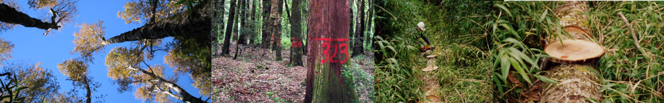
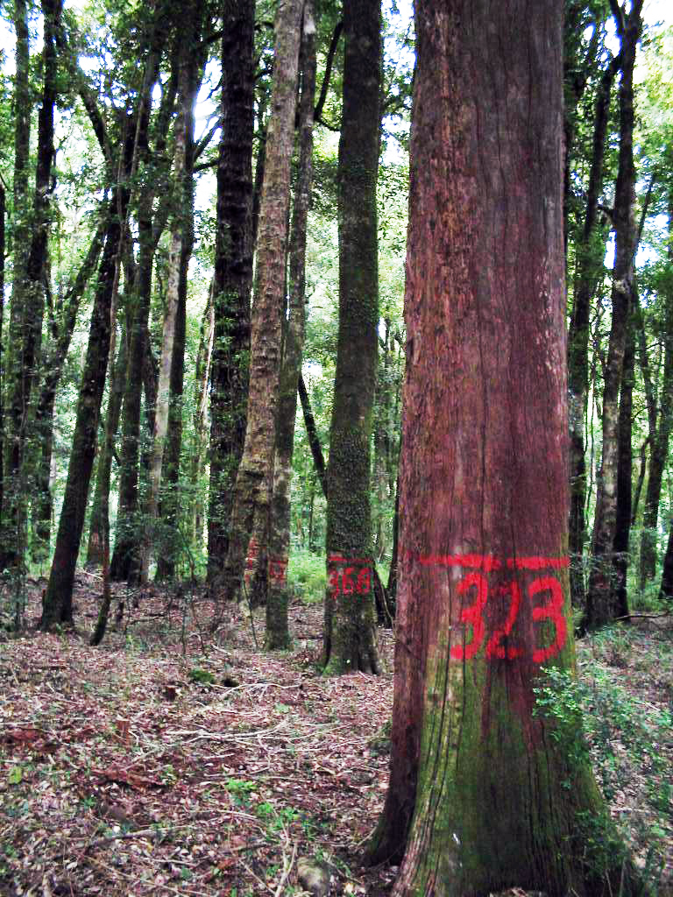

--------

My research focuses on developing and applying statistical and mathematical models to address scientific and decision-support problems of forests and ecology.

My main research interest is **biometrics**, i.e., applied statistics and mathematical modelling for understanding ecological and natural resources phenomena.

--------

## Research lines

* __Biometrics__. Applied statistics to ecology and natural resources.

* __Forest ecosystem modelling__.  Tree and stand-level growth models,
as well as tree allometry. 

* __Ecological modelling and statistical ecology__. System dynamics, differential equations, statistical inference.

* __Applied statistics__. Spatial statistics, sampling, estimation from remotely sensed images.

## Research projects

I am currently working on a couple of research projects, which can be found in the following [link](./resproj.md)

<!-- ### Footer

---
layout: page
title: Research 
excerpt: "Recent Research"
---
Last updated: August 2020 -->

